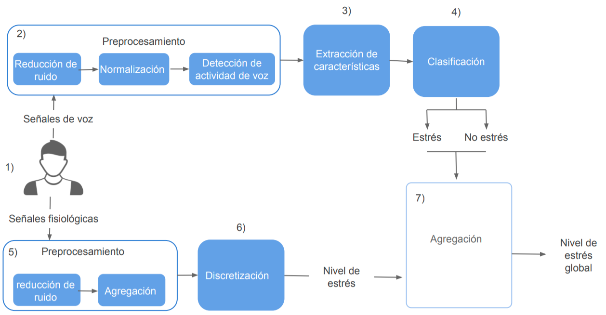
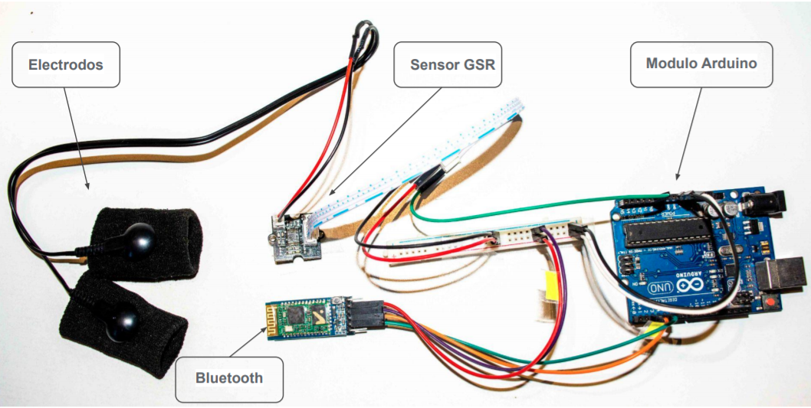
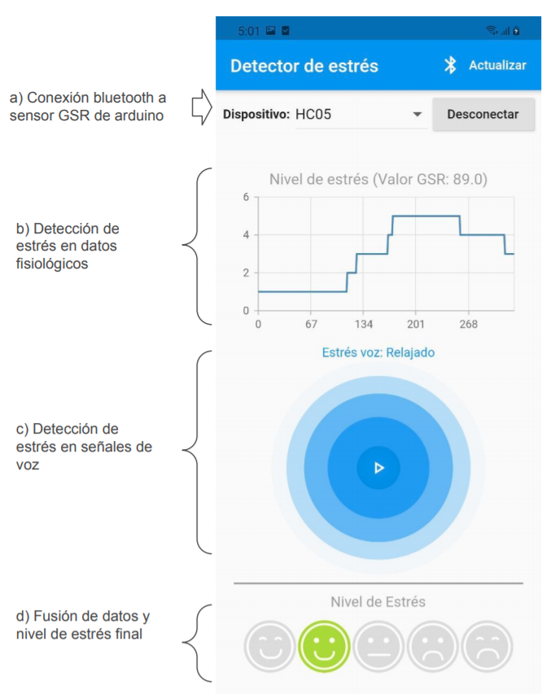

# Detección de niveles de estrés en tiempo real usando datos fisiológicos.
 

 

## Hardware

Implementacion desarrollado en [Arduino](https://www.arduino.cc/en/software), el código fuente se
encuentra
en [hardware_GSR/grs_recorder.ino](https://github.com/yonelyvan/stressDetection/blob/master/hardware_GSR/grs_recorder.ino)
y el circuito se muestra en la siguiente imagen.

 

## Implementación del aplicativo móvil

Aplicativo implementado para la plataforma [Android](https://www.android.com/intl/es_es/) usando el
framework [Flutter](https://flutter.dev/), el proyecto y código fuente se encuentra
en [APP/detector](https://github.com/yonelyvan/stressDetection/tree/master/APP/detector).

__Captura de pantalla de la aplicación:__

 

 